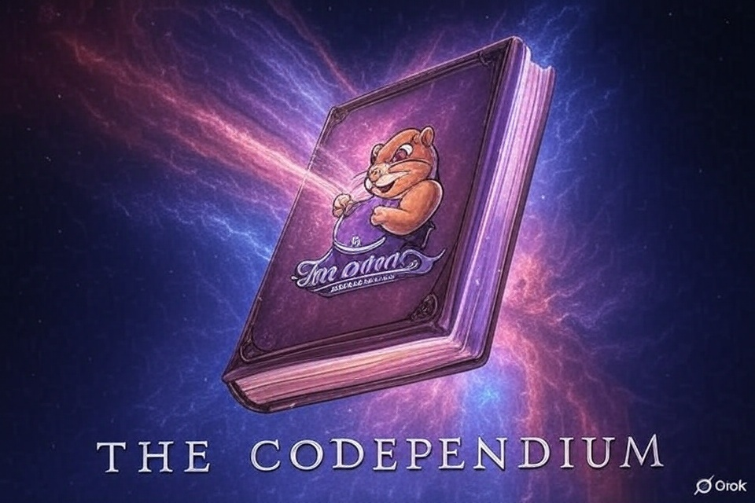

# The Codependium

Репозиторий для личных заметок.

## Index

## Тестирование

Тестирование бэкенд-приложений можно классифицировать по нескольким критериям.

**По типу автоматизации:**
- **Ручные тесты**\
Основными инструментами для бэка является взаимодейстующие приложения (например, фронт или мп),
Postman и Swagger. Суть ясна из названия.

- **Автотесты**\
Те же тесты, но реализованные в коде для автоматического применения локально или в пайпах.
Тут используются либы для написания тестов, моков, создания тестового окружения и т.п.

**По назначению:**

- **Функциональные**\
Проверяют бизнес-логику приложения.

- **Нефункциональные**\
Проверяют производительность, отказоустойчивость, безопасность. 
TODO: Про нефункциональщину можно разузнать побольше и дописать. Относятся ли сюда 
интеграционные тесты?

Для бэкенд-разработчика наиболее актуальными являются смоук-тесты и автотесты.

Для оценки покрытия тестами приложения используется пирамида тестирования. Её суть 
заключается в том, что количество тестов напрямую зависит от уровня их детализации.
Больше всего должно быть написано юнит-тестов. Затем идут интеграционные, затем e2e.

Стоит упомянуть, что хорошей практикой является запуск тестов в **CI/CD** пайплайнах.

**Unit-тесты**
Используются для тестирования одного юнита, т.е. наименьшей рабочей единицы, будь то функция, 
класс или его метод. Есть прикольные вопросы для проверки того, является 
ли тест юнитом:

> - Если тестируемый код натурально общается БД;
> - Или взаимодействует через интернет;
> - Или пользуется файловой системой;
> - Или не может быть запущен параллельно любому другому тесту;
> - Или нужно делать что-либо в окружении, чтобы запустить тесты.
> 
> Если на хотя бы один пункт Вы ответили "да", в таком случае Вы пишете не юнит-тест.

Юнитами покрываем бизнес-логику и утилки. Мокаем внешние слои для запуска.

**Интеграционные тесты**

Используются для проверки взаимодействия приложения с внешними сервисами – БДшками, 
FS, всё, что идёт через инет. Насколько я понимаю, есть разные тактики. Например,
для внешних интеграций проверяется статус-код респонса, а для БД можно также проверять
валидность данных после изменений.

По сути, здесь проверяются только слои, которые взаимодействуют с внешним миром, не 
вся система как в e2e. Для этих тестов необходимо обеспечить окружение.

**End-to-end**

В e2e'шках тестируется вся система полностью. Т.е., для бэкенда флоу представляет собой
деплой на тестовый стенд, где полностью воссоздана система, или такой же полный, но 
локальный деплой и последующие запуски тестов.

